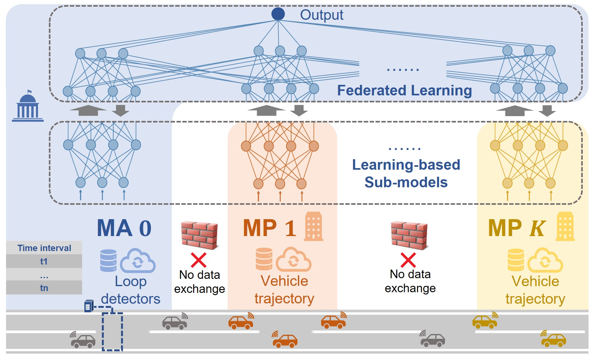

# FedTSE: Privacy-Preserving Data Fusion for Traffic State Estimation
Official implementation of [Privacy-Preserving Data Fusion for Traffic State Estimation: A Vertical Federated Learning Approach](https://arxiv.org/pdf/2401.11836)

<div align="center">
    
</div>

### Abstract

> This paper proposes a privacy-preserving data fusion method for traffic state estimation (TSE). Unlike existing works that assume all data sources to be accessible by a single trusted party, we explicitly address data privacy concerns that arise in the collaboration and data sharing between multiple data owners, such as municipal authorities (MAs) and mobility providers (MPs). To this end, we propose a novel vertical federated learning (FL) approach, FedTSE, that enables multiple data owners to collaboratively train and apply a TSE model without having to exchange their private data. To enhance the applicability of the proposed FedTSE in common TSE scenarios with limited availability of ground-truth data, we further propose a privacy-preserving physics-informed FL approach, i.e., FedTSE-PI, that integrates traffic models into FL. Real-world data validation shows that the proposed methods can protect privacy while yielding similar accuracy to the oracle method without privacy considerations.

### Preparation

1. Install the required packages:
```
pip install -r requirements.txt
```

2. Define an adjacency matrix:
   - Create an adjacency matrix file `adj_matrix = './adjacency_matrix.csv'`. This matrix should represent the connectivity between different nodes (e.g., road segments) in your traffic network.

3. Define a data processing script:
   - Create a script `src/data_process.py` to read and preprocess your data. The data's features should include custom features for each node, and the ground truth data should contain density and flow information for each road segment.


### Run
Train and test a new model:
```
python main_fedtse.py
```

### Note
This project is inspired by [https://github.com/yankang18/FedBCD].


### Reference
```
@article{wang2024privacy,
  title={Privacy-Preserving Data Fusion for Traffic State Estimation: A Vertical Federated Learning Approach},
  author={Wang, Qiqing and Yang, Kaidi},
  journal={arXiv preprint arXiv:2401.11836},
  year={2024}
}
```
<!-- 
----------
In case of any questions, bugs, suggestions or improvements, please feel free to contact me at qiqing.wang@u.nus.edu. -->